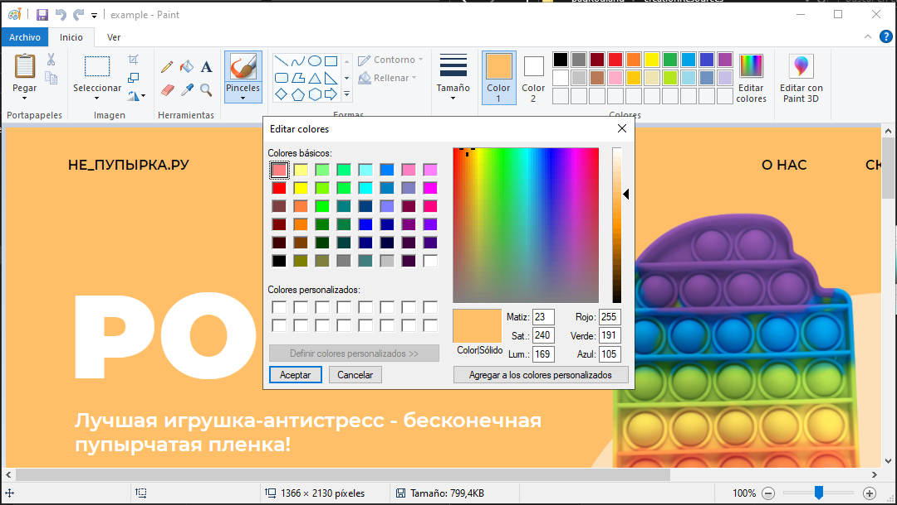
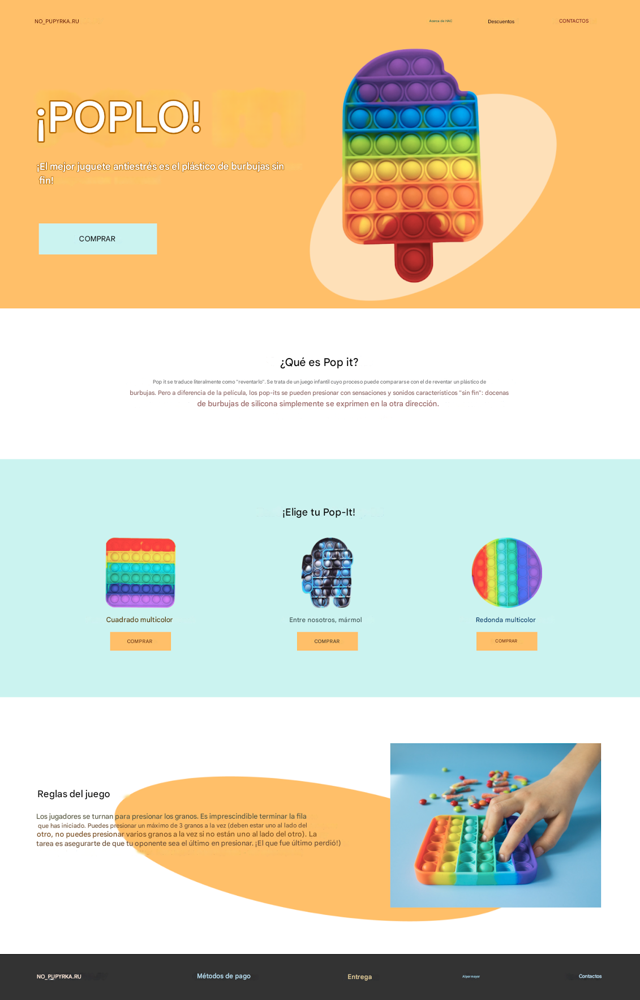
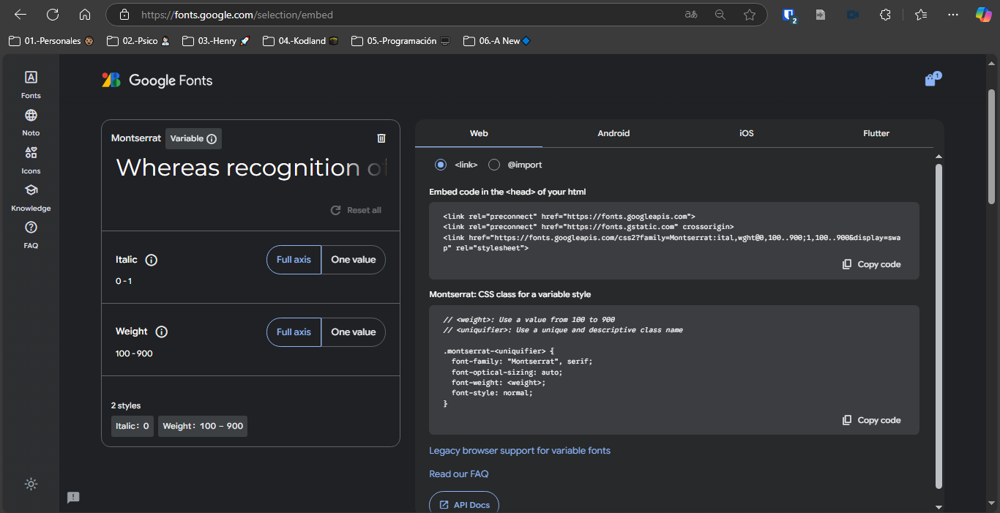
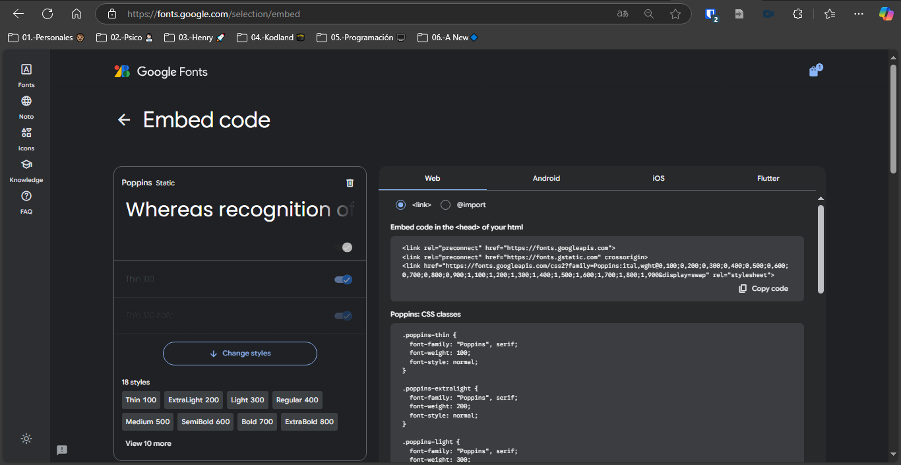
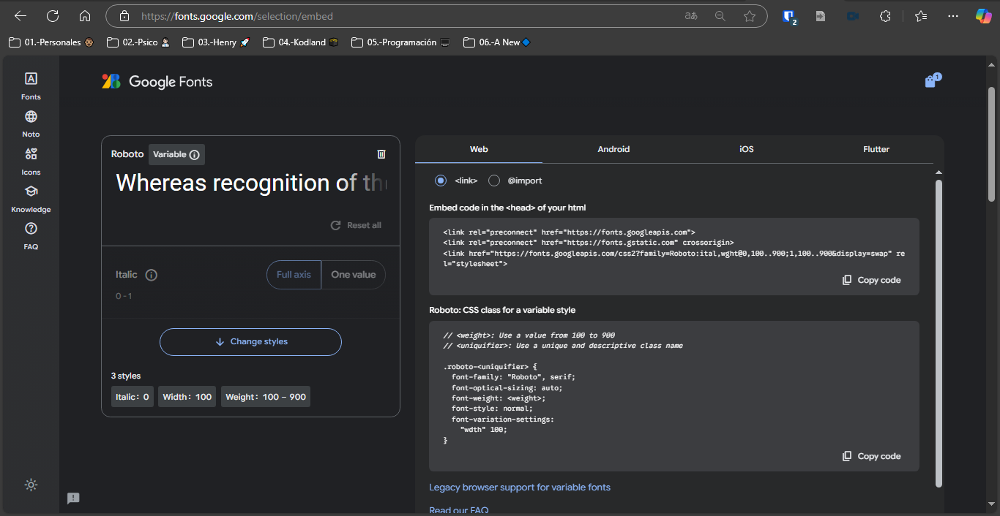

# kodland-Web
Este repositorio contine una página web con HTML, CSS y JS con miras a presentar prueba en Kodland para el cargo de tutor Web. 


<h2>PROCESO DE CREACIÓN DE LA PÁGINA WEB</h2>
<p>A continuación, se presentan módulos desplegables utilizando las etiquetas <code>&lt;summary&gt; / &lt;details&gt;</code>, donde se presenta el proceso de creación de la página web desde la creación del repositorio hasta la creación de la misma.
A pesar de ser un archivo tipo markdown, se utilizaran etiquetas HTML para que la presentación del mismo sea mas agradable y presentar por partes cada paso seguido para la creación del mismo.</p>

<details>
<summary> 01.- 🛠 Creación del Repositorio en GitHub </summary>

1. Se se inicializa el repositorio en [GitHub](https://github.com/devpsicoamgg/kodland-Web).  
2. Se ingresó el nombre del repositorio el cual fue bautizado como: `kodland-Web`.  
3. Se marca como **Public** por temas de accesibilidad accesible para los evaluadores de Kodland.  
4. Se inició con la plantilla de `README.md` dada por [GitHub](https://github.com/devpsicoamgg/kodland-Web/blob/main/README.md) y en la cual se agregaba la descripción del proyecto, así como la [licencia_tipo-MIT](https://github.com/devpsicoamgg/kodland-Web/blob/main/LICENSE). 
5. Se crea la estructura del proyecto en mi pc 💻, creando la carpeta `Frontend`, con los archivos `index.html` y `styles.css`.  
6. Se abre terminal bash en la carpeta raíz del proyecto y usando el comando <code>git clone https://github.com/devpsicoamgg/kodland-Web.git </code> se vincula. 
7. Se crea la estructura del proyecto en mi pc 💻, creando las carpeta `Frontend` (con los archivos `index.html` y `styles.css`), y la carpeta `creationResources` (donde se almacenaran imágenes de proceso de construcción del proyecto).
8. Se abre la terminal integrada de VSC y con el comando <code>ctrl + ñ</code>. 
9. Se agregan todos los archivos a git con el comando <code>git add .</code>.
10. Se realiza el primer commit <code>git commit -m "First push: added index.html, styles.css, modified README.md and folders creationResources and frontend"</code>
11. Se pushea por medio del comando <code>git push origin main</code>.
</details>

<details>
<summary> 02.- 📤 Cargue de imágenes  a https://cloudinary.com/, variables globales de CSS y colores</summary>

1. Se accede a la cuenta de `cloudinary` para el cargue de imágenes que se utilizaran en el proyecto.
2. Se cargan las imágenes para el uso en el proyecto. 
3. las direcciones obtenidas son: 
- **a. Fondo principal en rojo --bg-red:** https://res.cloudinary.com/dt1aacjqj/image/upload/v1739683800/background2_sv2a6u.png  
- **b. Fondo principal en rosa --bg-pink:** https://res.cloudinary.com/dt1aacjqj/image/upload/v1739683798/background_w21x4k.pn
- **c. Imagen de producto redonda --product-round-img:** https://res.cloudinary.com/dt1aacjqj/image/upload/v1739683799/round_xfhblw.png  
- **d. Imagen final mano niño/a --child-hand-img:** https://res.cloudinary.com/dt1aacjqj/image/upload/v1739683799/photo_k4pcy4.jpg  
- **e. Imagen de producto cuadrada --product-square-img:** https://res.cloudinary.com/dt1aacjqj/image/upload/v1739683798/square_lcpl4z.png  
- **f. Imagen de producto Among Us --product-amongus-img:** https://res.cloudinary.com/dt1aacjqj/image/upload/v1739683798/amongus_ahodxs.png  
- **g. Imagen circulo naranja oscuro --circle-orange:** https://res.cloudinary.com/dt1aacjqj/image/upload/v1739683798/bg-grid2_cieqgd.png  
- **h. Imagen circulo rosa --circle-pink:** https://res.cloudinary.com/dt1aacjqj/image/upload/v1739683798/bg-grid_qmnhcd.png
4. Se obtienen los RGB de colores del recuadro del "header" el de "productos" y fondo principal en rojo obteniendo con el cuentagotas de paint los valores: 
- `rgb(255, 191, 105)`-`#ffbf69;` - header. 
- `rgb(203, 243, 240)`-`#cbf3f0` - productos. 
- `rgb(252, 46, 32)`-`#fc2e20;` - img color rojo . 
5. Se actualizan el archivo `styles.css`, creando variables que están disponibles globalmente para las los colores obtenidos así. 
```
:root {
  --color-header-bg-color: #ffbf69;
  --product-box-bg-color: #cbf3f0;
  --color-red: #fc2e20;
}
```
- Se agregan estos pantallazos de la obtención a la carpeta creationResources así: 
<div align="center">
  
  
  
</div>  
</details>

<details>
<summary> 03.- 🤔 Determinantes para la creación de la página </summary>
<p>Teniendo como referente los estándares señalados en el archivo: 
<a href="https://docs.google.com/document/d/13Cgg9-YRnDmsapwbVPKHjwK7v8ADk3FqlABR1GpUJ7A/edit?tab=t.0" target="_blank">
WEB_Practical_task_for_the_tutor</a>. Se considera como relevante para la creación de la página con estos aspectos:
</p>

1. Combinación de Grid y Flexbox: 
- **Grid** para las estructuras principales, layouts como header, sección principal, productos y footer.
- **Flexbox** distribuir elementos en las secciones.
2. Diseño Responsivo: 
- **Responsive Design** se trabajará con media queries.
3. Integración de JavaScript: 
- **JavaScript** Se integrará JS para ventanas modales, menu hamburguesa.
4. Modularización como estrategia de código limpio y escalable: 
- **Codigo modularizado** se presentará el código modularizado en archivos para el JS, HTML, y CSS como ejercicio de buena practica, limpio y escalable.
</details>


<details>
<summary> 04.- 🈯 Traducción </summary>
<p>Teniendo como referente la página modelo que está en ruso, se utilizó el servicio de 
<a href="https://translate.google.com/?sl=auto&tl=es&op=images" target="_blank">Google Translate</a> 
para la traducción de la imagen obteniendo que la traducción se muestra así:</p>
<div align="center">
    
</div>

<code>&lt;header&gt;
  NO_PUPYRKA.RU - Acerca de HAC - Descuentos - CONTACTO
&lt;/header&gt; <br><br>
&lt;section class="hero"&gt;
  ¡POPLO! - ¡El mejor juguete antiestrés es el plástico de burbujas sin fin! - COMPRAR
&lt;/section&gt; <br><br>
&lt;section class="info"&gt;
  ¿Qué es Pop it? - Pop it se traduce literalmente como "reventarlo". Se trata de un juego infantil cuyo proceso puede compararse con el de reventar un plástico de burbujas...
&lt;/section&gt; <br><br>
&lt;section class="products"&gt;
  ¡Elige tu Pop-It! - Cuadrado multicolor - COMPRAR - Entre nosotros, mármol - COMPRAR - Redonda multicolor - COMPRAR
&lt;/section&gt; <br><br>
&lt;section class="rules"&gt;
  Reglas del juego - Los jugadores se turnan para presionar los granos...
&lt;/section&gt; <br><br>
&lt;footer&gt;
  NO_PUPYRKA.RU - Métodos de pago - Entrega - Al por mayor - Contactos
&lt;/footer&gt;</code>


**Nota** Teniendo en cuenta que NO_PUPYRKA.RU aparenta ser un link por su terminación .RU este se omitirá en este diseño
</details>

<details>
<summary> 04.- 🤯 Creación del Header </summary>

1. Se crea el header. 
2. Se agrega un favicon el cual se estiliza con la pagina de [favicon-converter](https://favicon.io/favicon-converter/). 
3. Se aplican estilos para el header. 
4. Se important fuentes de  [Google font](https://fonts.google.com/). 
5. 
<div align="center">
  
  
  </div> 

6. Se crea un primer hover con trasformación de color y tamaño. 
</details>

<details>
<summary> 05.- 🥇 Parte uno </summary>

1. Se crea la parte uno como una <code>&lt;section&gt;</code>. 
2. Se crean 2 <code>&lt;div&gt;</code> dentro de la section que contienen la img y el texto. 
3. Se agrega el btn. 
4. Se asignan estilos.
5. Se trabaja sobre estilos responsivos y en pantallas grandes para cada sección montada.
</details>

<details>
<summary> 06.- 🥈 Parte dos </summary>

1. Se crea la parte dos como una section. 
2. Se crean un titulo <code>&lt;h2&gt;</code> teniendo como referente que ya hay un titulo <code>&lt;h1&gt;</code> y para respetar ese sentido semántico de un solo titulo principal. 
3. Se asignan estilos.
4. Se trabaja sobre estilos responsivos y en pantallas grandes y versión 📱 mobile para la sección.
</details>

<details>
<summary> 07.- 🥉 Parte tres </summary>

1. Se crea la parte tres como una <code>&lt;section&gt;</code>. 
2. Esta <code>&lt;section&gt;</code> contiene un <code>&lt;div&gt;</code> padre que se bautiza con una clase llamada <code>&lt;div class="elements-list"&gt;</code>, los cuales agrupan por <code>&lt;div&gt;</code> los elementos que se muestran en el catálogo
3. Se asignan estilos.
4. Se trabaja sobre estilos responsivos y en pantallas grandes y versión 📱 mobile para la sección.
</details>

<details>
<summary> 07.- 🏅 Parte final en el body </summary>

1. Se crea la parte final como una <code>&lt;section&gt;</code> con la clase "part-final". 
2. Esta <code>&lt;section&gt;</code> contiene tres <code>&lt;div&gt;</code> a saber, circle, paragraph e img-hand 
3. Se asignan estilos.
4. Se trabaja sobre estilos responsivos y en pantallas grandes y versión 📱 mobile para la sección.
</details>

<details>
<summary> 08.- 🦶 Creación del Footer </summary>

1. Se crea el footer <code>&lt;footer&gt;</code> con la clase "footer-content". 
2. Éste al igual que el <code>&lt;header&gt;</code> tiene un <code>&lt;nav&gt;</code> que anida una lista

</details>

<details>
<summary> 09.- 🍔 Hamburger Menu </summary>

1. Se agrega un btn que sirvió para referenciar el menu. 
2. En [Google Icons](https://fonts.google.com/icons) se obtiene el menu. 
3. Se modifica con la paleta de colores que dispone el diseño usando el color <code>#fc2e20</code>.
4. Se da interactividad con JS, para tal fin: 
- Se agrega un addEventListener. 
- Se obtienen los elementos asociados al evento (que al cambiar el tamaño aparezca o desaparezca)
- Evento 1. Menu al hacer click se alterna el estado activo en el nav-menu. 
- Evento 2. Para dispositivos menores de 768px se active y modifique el nav-menu. 
- Evento 3. Evitar que se cierre si se hacen click dentro del menú. 
- Evento 4. Cerrar el menú si se hace click fuera de él. 
5. Se manejan estilos en el CSS de display: none ante pc y dispositivos mayores a 769px y display: block ante dispositivos mayores a 768px


</details>


<details>
<summary> 10.- ❎ Ventana Modal </summary>

1. Se agrega ventana modal manejado por JS en el control de validación de formulario y aparición de la misma. 
2. Se da interactividad con JS, para tal fin: 
- Se integra al addEventListener del menú hamburguesa. 
- Se obtienen los elementos asociados al evento (que cierre, se abra y el modal en si mismo)
- Con un forEach se asocian 2 listeners para un solo evento. 
- Se remueve la clase active para cerrar el modal fuera del formulario o al dar click en la X. 
- Se hacen validaciones de todos los campos. 
- Al envío del form se muestra un alert. 

</details>

<details>
<summary> 11.- 🔨 Herramientas para la construcción </summary>

1. Resúmenes de HTML en [GitHub-HTML](https://github.com/devpsicoamgg/myHTMLNotesAMGG/blob/main/html/index.html). 
2. Resúmenes de CSS en [GitHub-CSS](https://github.com/devpsicoamgg/myHTMLNotesAMGG/tree/main/css).
3. Resúmenes de JS en [GitHub-JS](https://github.com/devpsicoamgg/myJSNotesAMGG).

</details>


<div style="font-size: 24px; font-weight: bold; text-align: center;">
  😃 PUEDES VISITAR EL SITIO DEPLOYADO DESDE NETLIFY EN   <br>
  <a href="https://rainbow-strudel-eb3ab1.netlify.app/" target="_blank" style="font-size: 28px; color: #007bff; text-decoration: none; font-weight: bold;">
    https://rainbow-strudel-eb3ab1.netlify.app/
  </a>
</div>
