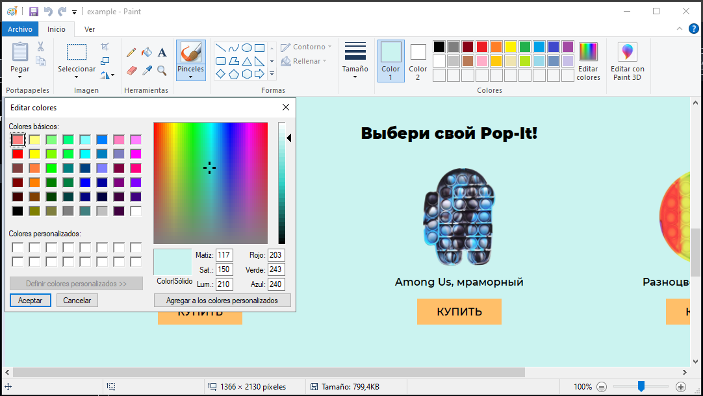

# kodland-Web
Este repositorio contine una página web con HTML, CSS y JS con miras a presentar prueba en Kodland para el cargo de tutor Web. 


<h2>PROCESO DE CREACIÓN DE LA PÁGINA WEB</h2>
<p>A continuación, se presentan módulos desplegables utilizando las etiquetas <code>&lt;summary&gt; / &lt;details&gt;</code>, donde se presenta el proceso de creación de la página web desde la creación del repositorio hasta la creación de la misma.
A pesar de ser un archivo tipo markdown, se utilizaran etiquetas HTML para que la presentación del mismo sea mas agradable y presentar por partes cada paso seguido para la creación del mismo.</p>

<details>
<summary> 01.- 🛠 Creación del Repositorio en GitHub </summary>

1. Se se inicializa el repositorio en [GitHub](https://github.com/devpsicoamgg/kodland-Web).  
2. Se ingresó el nombre del repositorio el cual fue bautizado como: `kodland-Web`.  
3. Se marca como **Public** por temas de accesibilidad accesible para los evaluadores de Kodland.  
4. Se inició con la plantilla de `README.md` dada por [GitHub](https://github.com/devpsicoamgg/kodland-Web/blob/main/README.md) y en la cual se agregaba la descripción del proyecto, así como la [licencia_tipo-MIT](https://github.com/devpsicoamgg/kodland-Web/blob/main/LICENSE). 
5. Se crea la estructura del proyecto en mi pc 💻, creando la carpeta `Frontend`, con los archivos `index.html` y `styles.css`.  
6. Se abre terminal bash en la carpeta raíz del proyecto y usando el comando <code>git clone https://github.com/devpsicoamgg/kodland-Web.git </code> se vincula. 
7. Se crea la estructura del proyecto en mi pc 💻, creando las carpeta `Frontend` (con los archivos `index.html` y `styles.css`), y la carpeta `creationResources` (donde se almacenaran imágenes de proceso de construcción del proyecto).
8. Se abre la terminal integrada de VSC y con el comando <code>ctrl + ñ</code>. 
9. Se agregan todos los archivos a git con el comando <code>git add .</code>.
10. Se realiza el primer commit <code>git commit -m "First push: added index.html, styles.css, modified README.md and folders creationResources and frontend"</code>
11. Se pushea por medio del comando <code>git push origin main</code>.
</details>

<details>
<summary> 02.- 📤 Cargue de imágenes  a https://cloudinary.com/, variables globales de CSS y colores</summary>

1. Se accede a la cuenta de `cloudinary` para el cargue de imágenes que se utilizaran en el proyecto.
2. Se cargan las imágenes para el uso en el proyecto. 
3. las direcciones obtenidas son: 
- **a. Fondo principal en rojo --bg-red:** https://res.cloudinary.com/dt1aacjqj/image/upload/v1739683800/background2_sv2a6u.png  
- **b. Fondo principal en rosa --bg-pink:** https://res.cloudinary.com/dt1aacjqj/image/upload/v1739683798/background_w21x4k.pn
- **c. Imagen de producto redonda --product-round-img:** https://res.cloudinary.com/dt1aacjqj/image/upload/v1739683799/round_xfhblw.png  
- **d. Imagen final mano niño/a --child-hand-img:** https://res.cloudinary.com/dt1aacjqj/image/upload/v1739683799/photo_k4pcy4.jpg  
- **e. Imagen de producto cuadrada --product-square-img:** https://res.cloudinary.com/dt1aacjqj/image/upload/v1739683798/square_lcpl4z.png  
- **f. Imagen de producto Among Us --product-amongus-img:** https://res.cloudinary.com/dt1aacjqj/image/upload/v1739683798/amongus_ahodxs.png  
- **g. Imagen circulo naranja oscuro --circle-orange:** https://res.cloudinary.com/dt1aacjqj/image/upload/v1739683798/bg-grid2_cieqgd.png  
- **h. Imagen circulo rosa --circle-pink:** https://res.cloudinary.com/dt1aacjqj/image/upload/v1739683798/bg-grid_qmnhcd.png
4. Se obtienen los RGB de colores del recuadro del "header" el de "productos" y fondo principal en rojo obteniendo con el cuentagotas de paint los valores: 
- `rgb(255, 191, 105)`-`#ffbf69;` - header. 
- `rgb(203, 243, 240)`-`#cbf3f0` - productos. 
- `rgb(252, 46, 32)`-`#fc2e20;` - img color rojo . 
5. Se actualizan el archivo `styles.css`, creando variables que están disponibles globalmente para las los colores obtenidos así. 
```
:root {
  --color-header-bg-color: #ffbf69;
  --product-box-bg-color: #cbf3f0;
  --color-red: #fc2e20;
}
```
- Se agregan estos pantallazos de la obtención a la carpeta creationResources así: 
<div align="center">
  
  
  
</div>  